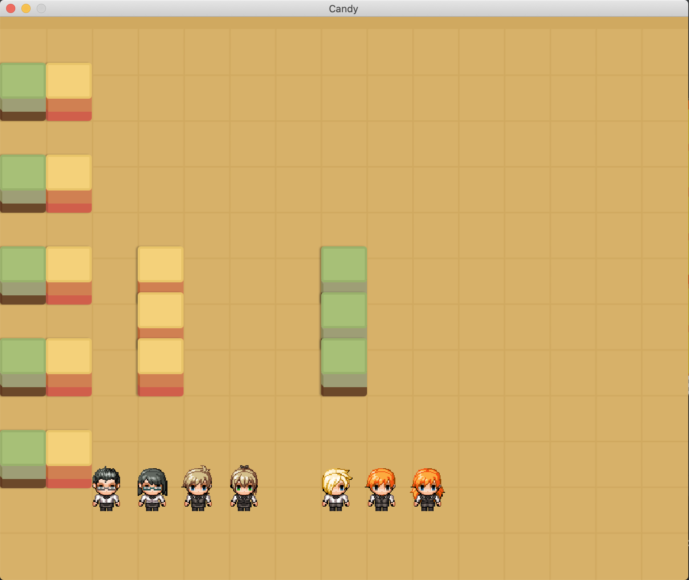

# Candy

Simple 2D multi-player online game.

## Prerequisites

- [Go v1.15.6](https://golang.org/doc/install)

## Getting Started

### Start server
```bash
go run pubsub_server.go
go run game_server.go
```

### Create a game
```bash
go run client.go
```

### Join a game created
```bash
go run client.go [game_id]

// eg.
// go run main.go 5f7e7c8e-ffe5-428f-9880-7afa23609c0b
```

### Join remote game server

1. Start remote servers
2. Update `.env` to include the host name & port of the remote servers

### Start the game
The game will automatically start for all players when the creator clicks on the sign in screen.




## Usage

| Action | Function | 
| ------ | -------- |
| Up arrow key | Move player upward |
| Donw arrow key | Move player downward |
| Left arrow key| Move player to the left |
| Right arrow key| Move player to the right |

## Testing

```bash
go test ./...
```

## Tools

### Format code

```bash
goimports -w .
```

## Author

- Harry - *Initial works*

## Contributors

## License

This project is maintained under MIT license.